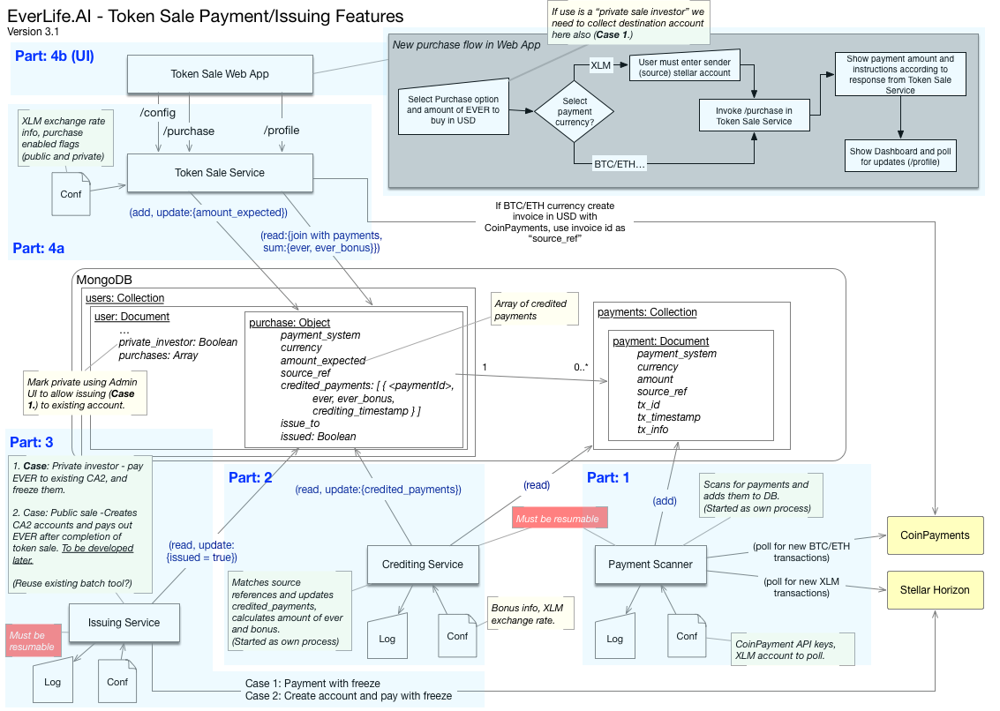

# everlife-token-sale-model

The common model against which token sale services work

## Rationale

The Token Sale App uses MongoDB to store its state. The application is modularised into different parts with their own responsibilities. Since all parts use the database as their means of affecting and persisting the application state we have created this module the document schemas for all other modules in the application.

The model module exposes the [Mongoose](https://mongoosejs.com/docs/guide.html) models directly. Several utility methods have been added to the models to reduce complexity of using the models. Exposing the raw models with added methods aims at striking a balance between freedom and convenience for the callers. 

### Overview

The diagram below shows the datamodel, represented by this module, in the center, with the webb service/app and other services using it.

 


## Models

### Lock

Can be used to prevent inadvertent concurrent execution of scripts against the database by registering a "lock" document in the database. 

### User

Model represeting the "User", purchases and the crediting of these purchases against the Payment model.

### Payment

Registry of received payments.

## Typical Usage in a service module

```
const model = require('everlife-token-sale-model');
const { Lock, User, Payment } = model;

const dbUrl = 'mongodb://localhost';
const serviceName = 'myTokenSaleService'

model.connectDb(dbUrl)
    .then(() => Lock.acquireLock(serviceName))
    .then(() => performWorkReturnPromise())
    .finally(() => Lock.releaseLock(serviceName))
    .finally(() => model.closeDb())
    .catch(err => {
        log('Unexpected error:', err);
        process.exit(-1);
    });

```

Here the method `performWorkReturnPromise()` uses the model and its methods to interact with the database. It must return a `Promise` which is resolved when processing is completed.
